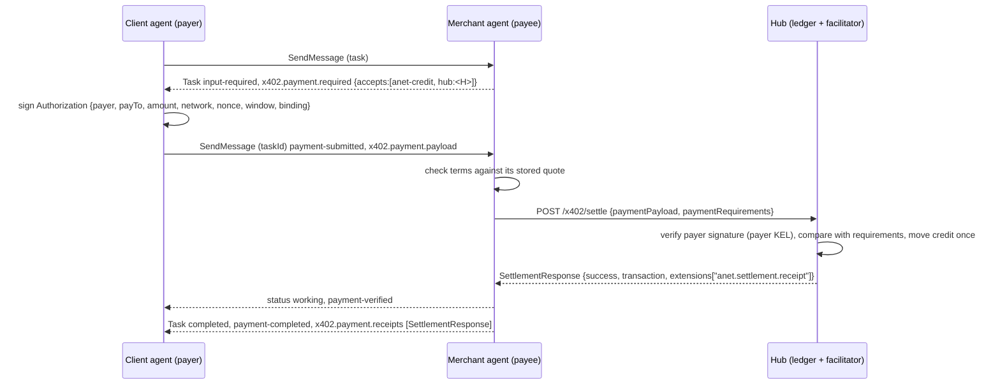

# `anet-credit` Payment Scheme (custodial ledger)

> **DRAFT — not submitted; requires product owner approval before any external submission.**
>
> **License: Apache-2.0**, like the target directory `a2a-x402/schemes/`: this document is licensed
> under the Apache License 2.0 alone (ANet `LICENSE`, condition 3).

This document specifies the `anet-credit` scheme for x402 v2 as used by the A2A x402 extension
v0.2. It follows the layout of the experimental schemes in `a2a-x402/schemes/`. Rules marked
**(designed)** are specified in the anet design (A2A-DESIGN r3 §8, X4) and not yet implemented in
the reference client; everything else was checked against the reference code (ANetCore `payment`,
ANetHub `internal/aghub/facilitator.go`, ANet `module/x402`).

## Scheme Name

`anet-credit`

## Summary

`anet-credit` moves an integer balance on a ledger kept by one hub. The hub is at the same time the
ledger, the facilitator and the custodian of every balance on it. The payer signs an authorization
for one payment to one payee on one hub's ledger; the payee (the merchant agent) presents it to that
hub's facilitator; the hub moves the credit once and returns a receipt it signs.

## Key Features

- **Custodial, and says so.** On a chain a facilitator broadcasts what the payer signed and cannot
  divert funds. Here the hub holds the balances. Choosing a hub is choosing whom to trust with them.
  The scheme does not claim otherwise, which is why it is not called `exact`.
- **Authorizations are signed by the payer and receipts by the hub.** Neither party depends on the
  other's database to prove what happened; both keep the signed objects in their own evidence logs.
- **Once per authorization, once per task.** An authorization settles at most once (idempotent on
  its content id). An authorization that names a task binding settles only if no other authorization
  from the same payer with the same binding has settled.
- **No task content at the facilitator.** The requirements sent to the facilitator carry no
  resource description (see Privacy).
- **Cross-hub clearing.** A payee registered at hub B can be paid from a balance at hub A when the two
  hubs clear against each other. The payment settles on A's ledger; B credits its payee on the
  strength of A's signed receipt.

## Protocol Flow Overview

Inside A2A (a2a-x402 v0.2, Standalone Flow), all payment objects travel in message metadata between
the client agent and the merchant agent. With the anet relay binding these messages are end-to-end
encrypted; the hub sees only step 5.

1. Client agent sends a task to the merchant agent.
2. Merchant agent answers `input-required` with `x402.payment.status: payment-required` and
   `x402.payment.required` (an x402 v2 `PaymentRequired` whose `accepts` lists `anet-credit` options).
3. Client agent (or its signing service) selects an option and signs an `Authorization` (below).
4. Client agent sends `x402.payment.status: payment-submitted` with `x402.payment.payload` (an x402
   v2 `PaymentPayload`) on the same task.
5. Merchant agent checks the authorization against its quote, then calls
   `POST {facilitator}/x402/settle` with `{x402Version, paymentPayload, paymentRequirements}`.
6. On success it reports `payment-verified`, performs the work, and completes the task with
   `payment-completed` and `x402.payment.receipts`.

## Sequence Diagram



## `PaymentRequirements` for `anet-credit`

One entry of `PaymentRequired.accepts` (x402 v2 field names):

```json
{
  "scheme": "anet-credit",
  "network": "hub:bafyreicg3paeuo2nt4n575adgnovtr2y7aizti7643fxhk6zbmiaaa7q7y",
  "amount": "5",
  "asset": "credit",
  "payTo": "bafyrei…payee",
  "maxTimeoutSeconds": 300
}
```

| Field | Rule |
|---|---|
| `scheme` | `anet-credit` |
| `network` | `hub:` followed by the AID of the hub whose ledger settles the payment. Two hubs are two networks: a credit on one is not a credit on the other. See Deviation 1 |
| `amount` | whole credits, unsigned 64-bit, as a decimal string |
| `asset` | `credit` |
| `payTo` | the payee's AID |
| `maxTimeoutSeconds` | the reference merchant uses 300, its authorization window |
| `extra` | absent. MUST be absent (or empty) in the requirements sent to the facilitator |

A merchant lists its own hub's network first, then the networks of the peer hubs its hub clears
against (read from `GET {hub}/x402/supported`). The payer picks one.

The `PaymentRequired` object itself (not sent to the facilitator) has `x402Version: 2` and MAY carry a
`resource` naming the skill; it travels only inside the end-to-end encrypted task messages.

A quote is valid for 24 hours; the merchant refuses payment for an expired quote with
`EXPIRED_PAYMENT` **(designed)**.

## `PaymentPayload` Structure

```json
{
  "x402Version": 2,
  "accepted": { "scheme": "anet-credit", "network": "hub:…", "amount": "5", "asset": "credit",
                "payTo": "bafyrei…payee", "maxTimeoutSeconds": 300 },
  "payload": { "authorization": "<standard base64 of the signed Authorization>" }
}
```

`accepted` is the option the payer took, copied from `accepts`. It is not signed; the facilitator
checks it against both the signed authorization and the requirements (Verification, step 4).

### Authorization

`payload.authorization` is standard base64 (RFC 4648 §4, padded) of a CoreDet-CBOR map (RFC 8949
§4.2.1 deterministic encoding, integer keys, no tags):

```cddl
SignedAuthorization = {
  1 => Authorization,
  2 => AObjEnvelope,        ; the payer's detached signature
}

Authorization = {
  1 => tstr,                ; payer: payer AID
  2 => tstr,                ; payTo: payee AID
  3 => uint,                ; amount: whole credits
  4 => tstr,                ; network: "hub:<ledger hub AID>"
  5 => tstr,                ; nonce
  6 => int,                 ; issued_at: unix ms, > 0
  7 => int,                 ; not_after: unix ms, > issued_at
  ? 8 => tstr,              ; interaction_id: task binding (see Binding)
}

AObjEnvelope = {
  1 => tstr,                ; signer_aid; MUST equal Authorization.payer
  2 => uint,                ; key_state_seq of the signer's KEL
  3 => -8,                  ; alg: EdDSA (COSE)
  4 => bstr .size 64,       ; sig
  ? 5 => tstr,              ; preimage_ref (unused)
}
```

### Signature

```
preimage = CoreDet-CBOR(Authorization)          ; key 8 omitted when empty
sig      = Ed25519(key of payer at key_state_seq, preimage)
```

The key is found by replaying the payer's key event log (KEL). The signer becomes the payer: an
authorization cannot pay from someone else's balance.

**Authorization id.** `CIDv1(dag-cbor, sha2-256, base32)` of the same preimage (a string beginning
`bafyrei`). It is the facilitator's idempotency key and the `transaction` value of the settlement.

### Nonce and validity window

- The nonce makes two otherwise identical authorizations distinct. The reference client uses 12
  random bytes, lower-case hex (24 characters). The facilitator does not keep a nonce table:
  uniqueness is enforced on the authorization id, which covers the nonce.
- An authorization is spendable while `issued_at − 2 min <= now <= not_after + 2 min` (the 2-minute
  skew allowance is applied at both ends). The reference client uses a 5-minute window.
- The facilitator always checks the signature at `issued_at`. For `/verify` and for a new
  settlement it additionally checks that the window is open and that the signing key is still
  current now. A key the payer has rotated away therefore cannot sign a spendable authorization by
  back-dating it, while a merchant asking again about an authorization that already settled still
  gets its receipt after the window has closed.

### Binding

The optional `interaction_id` binds the payment to the task it pays for. Without it an authorization
is a bearer instrument for any work owed by that payee.

**(designed, A2A-DESIGN X4)** The value is not the task id but a hash that the facilitator cannot
invert:

```
interaction_id = hex( SHA-256( "anet/x402-bind/v1" || 0x00 || taskId || 0x00 || task_nonce ) )
```

where `task_nonce` is a 16-byte random value inside the requester's signed task document. The
reference client currently puts the task id itself in this field.

## Facilitator Responsibilities

### `GET /x402/supported`

```json
{
  "kinds": [{"x402Version": 2, "scheme": "anet-credit", "network": "hub:<this hub>"},
            {"x402Version": 2, "scheme": "anet-credit", "network": "hub:<peer hub it clears with>"}],
  "extensions": ["anet.settlement.receipt"],
  "signers": {"hub:<this hub>": ["<this hub AID>"], "hub:<peer>": ["<peer AID>"]},
  "anet.signer_kel": {"<hub AID>": "https://…/hub/identity"}
}
```

`signers` names the hub that signs receipts for each network; `anet.signer_kel` (an anet addition,
ignored by other clients) says where that hub's KEL is served, which is what a receipt is verified
against.

### `POST /x402/verify` and `POST /x402/settle`

Request body (x402 v2): `{"x402Version": 2, "paymentPayload": {…}, "paymentRequirements": {…}}`.
`paymentRequirements` is **required**. A facilitator given only the payload would settle whatever the
payer signed, and could not tell the quoted price paid to the quoting merchant from a smaller amount
paid to someone else. A missing or unreadable body is answered 400 with the error reason; every other
outcome is 200 with a `VerifyResponse` / `SettlementResponse`.

Verification, for a payment on this hub's own ledger:

1. `accepted.scheme` is `anet-credit` and `accepted.network` is this hub's network.
2. The authorization decodes; its `network` is this hub's network.
3. The payer is registered here; the signature verifies against the payer's KEL at `issued_at`.
4. Requirements: `requirements.scheme` is `anet-credit` and equals `accepted.scheme`;
   `accepted.network` and `authorization.network` equal `requirements.network`;
   `authorization.payTo` equals `requirements.payTo` and `accepted.payTo`;
   `accepted.amount` equals `authorization.amount`; `authorization.amount >= requirements.amount`.

Settlement then:

5. If this authorization id has already settled, return the original response with the original
   receipt and `extensions["anet.replayed"] = true`. This check comes after step 4 (a receipt is
   returned only to a caller asking on the terms it was settled for) and before the window check (a
   merchant whose call timed out can learn the outcome at any later time).
6. The window is open and the signing key is current now.
7. If the authorization has a non-empty `interaction_id` and another authorization from the same
   payer with the same `interaction_id` has settled: refuse with `duplicate_binding`, nothing moves,
   and `extensions["anet.original_transaction"]` names the settlement that holds the binding.
8. Balance check, then debit the payer and credit the payee in one transaction; sign the receipt.

The facilitator settles the **authorized** amount, which may exceed the required amount; the
reference client always authorizes exactly the required amount.

### Settlement response and receipt

```json
{
  "success": true,
  "payer": "bafyrei…payer",
  "transaction": "bafyrei…authorization-id",
  "network": "hub:…",
  "amount": "5",
  "extensions": {"anet.settlement.receipt": "<standard base64>"}
}
```

The receipt is the hub's signed statement:

```cddl
SignedReceipt = { 1 => Receipt, 2 => AObjEnvelope }   ; envelope by the ledger hub
Receipt = {
  1 => tstr,    ; auth_id (= transaction)
  2 => tstr,    ; payer
  3 => tstr,    ; payTo
  4 => uint,    ; amount
  5 => tstr,    ; network
  6 => int,     ; settle_at (unix ms)
}
```

A verifier checks the receipt against the KEL of the hub named by `network` (not merely the hub that
happened to answer): a hub signing a receipt for a payment on someone else's ledger is rejected.

On failure: `success: false`, `errorReason` (one of the constants below, exactly, with no suffix),
`payer`, `amount` and `transaction` when the authorization could be read, and
`extensions["anet.error_detail"]` with human-readable detail.

### Cross-hub payments

When `network` names a peer hub, the hub the merchant calls (the entry hub) runs step 4 without
verifying the signature (it does not hold the payer's KEL), then forwards
`{x402Version, paymentPayload, paymentRequirements}` to the ledger hub, which runs the full procedure.
The entry hub credits its own payee only when the ledger hub's receipt matches the requirements
(`payTo`, `amount`), and records what the ledger hub owes it. A transport error, a timeout, or "the
ledger hub settled but the entry hub has not yet credited" is reported as `settlement_pending`, which
is not final: the merchant retries with the same payload (idempotent on the authorization id).
`/x402/verify` does not forward and answers `network_mismatch` for another hub's network.

### `errorReason` constants and a2a-x402 error codes

x402 leaves `errorReason` open. An anet facilitator sends exactly one of the values below. The merchant
agent maps them to the a2a-x402 `x402.payment.error` codes (a2a-x402 v0.2 §9.1) and puts the original
reason in `anet.reason` where the mapping loses information. The mapping table is **(designed,
A2A-DESIGN §8.5)** and will be pinned by tests on both sides.

| `errorReason` / merchant-side check | Meaning | `x402.payment.error` |
|---|---|---|
| `insufficient_funds` | balance does not cover the amount | `INSUFFICIENT_FUNDS` |
| `invalid_signature` | signature does not verify against the payer's KEL (includes a signature over other terms) | `INVALID_SIGNATURE` |
| `expired_payment` | outside the window, or no valid window | `EXPIRED_PAYMENT` |
| merchant: quote older than 24 h | — | `EXPIRED_PAYMENT` |
| `duplicate_nonce` | this authorization already settled (answered by `/verify`; `/settle` returns the original receipt instead) | `DUPLICATE_NONCE` |
| `duplicate_binding` | another authorization with the same payer and binding already settled | `DUPLICATE_NONCE` |
| `network_mismatch` | signed for, or offered on, another ledger | `NETWORK_MISMATCH` |
| merchant: scheme/network not among the quoted options | — | `NETWORK_MISMATCH` |
| `invalid_amount` | amount below the requirement, or `accepted.amount` ≠ authorized amount, or not a whole number | `INVALID_AMOUNT` |
| `payee_mismatch` | pays someone other than the required payee | `SETTLEMENT_FAILED`, `anet.reason` = the errorReason |
| `unsupported_scheme` | not `anet-credit`, or payload and requirements disagree | `SETTLEMENT_FAILED`, `anet.reason` |
| `unknown_payer` | payer not registered at the ledger hub | `SETTLEMENT_FAILED`, `anet.reason` |
| `malformed_payment` | the payload cannot be read | `SETTLEMENT_FAILED`, `anet.reason` |
| `invalid_payment_requirements` | requirements missing or unreadable | `SETTLEMENT_FAILED`, `anet.reason` |
| `settlement_failed` | any other failure (storage, corrupt KEL, peer receipt not matching the terms) | `SETTLEMENT_FAILED`, `anet.reason` |
| merchant: payee, binding, or no open quote | — | `SETTLEMENT_FAILED`, `anet.reason` |
| `settlement_pending` | outcome not known yet | *not mapped*: not final, no `payment-failed` is sent; the merchant retries |

The deprecated value `expired` was never sent by a hub and is not used.

## A2A usage notes

The merchant-side and payer-side task rules in this section are **(designed, A2A-DESIGN §8.2–§8.4)**;
the reference daemon's same-task payment flow is being implemented.

- Metadata keys are those of a2a-x402 v0.2: `x402.payment.status`, `x402.payment.required`,
  `x402.payment.payload`, `x402.payment.receipts`, `x402.payment.error`. The objects are x402 **v2**
  objects (`x402Version: 2`).
- The merchant reports `payment-verified` (task `working`) after a successful settlement and before it
  starts work.
- `x402.payment.receipts` holds every `SettlementResponse` of the task, failed ones included
  (`{success: false, errorReason, network, transaction: ""}` when nothing could be read), and is
  present in the final message of any task on which a settlement happened, whether the task ends
  `completed`, `failed` or `canceled`.
- A merchant that has persisted a payment as submitted refuses a second payment on the same task until
  the first has a final outcome; a payer does not sign a new authorization for a task while an earlier
  one has no final outcome. Together with the binding rule this prevents paying twice for one task
  when a response is lost **(designed)**.
- After a successful settlement a cancel request no longer cancels the task: the merchant finishes
  the work, or fails with the receipts attached.

## Deviations

### Deviation 1: network identifier is not CAIP-2

x402 v2 identifies networks with CAIP-2 (`namespace:reference`, with `reference` matching
`[-_a-zA-Z0-9]{1,32}`). `hub:<AID>` has the CAIP-2 shape and a valid namespace, but the reference is a
59-character CIDv1 string, longer than CAIP-2 allows. Truncating it would lose the property that the
network names the hub whose key signs its receipts. The identifier appears in signed objects across
three code bases, so it is not changed in this version; a CAIP-2-conformant form (for example a
registered namespace with a 32-character hash of the AID) is an open question for the x402 and
a2a-x402 maintainers.

### Deviation 2: the local signing service accepts an unsigned selection

a2a-x402 §5.1 separates the client agent from the "signing service or wallet" but defines no message
by which a client asks a signing service it reaches over A2A to sign. In anet the client agent's own
node is that signing service and is itself reached over A2A (its 127.0.0.1 interface). The node
therefore accepts, on a task it proxies **(designed, A2A-DESIGN §8.7)**:

- `x402.payment.status: payment-submitted` **without** `x402.payment.payload`, and
- `anet.payment.accept`: the selected option, copied verbatim from `x402.payment.required.accepts`
  (may be omitted when there is exactly one option).

The node checks that the selected option is byte-for-byte one of the options stored for that task,
applies its spending limits, signs the authorization, and forwards a standard `PaymentPayload` to the
merchant inside the encrypted envelope. The merchant sees ordinary a2a-x402. Consequences:

- A client-supplied `x402.payment.payload` is refused with `payment-failed`,
  `x402.payment.error: SETTLEMENT_FAILED`, `anet.reason: client_payload_unsupported` (its payer would
  not be this node, so it could not settle anyway); a selection not among the offered options with
  `anet.reason: option_not_offered`.
- The node's proxy card declares the a2a-x402 extension with `required` omitted and params
  `{"signer": "anet-daemon", "clientPayload": false}`.
- A client that did not activate the extension still sees the x402 keys. Payments within the
  automatic limit are made by the node; above it the task stays `input-required` with
  `anet.reason: payment_extension_not_activated`.

## Security Considerations

**Custody.** The hub can freeze, misstate or lose balances. It cannot forge a payer's authorization,
cannot settle one twice, and cannot rewrite a receipt it signed: payer and payee both hold the signed
objects. Credit supply changes are recorded by the hub in a signed, hash-linked issuance chain that
third parties can witness.

**Facilitator.**
- MUST require `paymentRequirements` and compare both the signed authorization and the unsigned
  `accepted` option with them.
- MUST verify the payer's signature against the payer's KEL, and the window and current key for a new
  settlement.
- MUST settle an authorization id at most once and answer repeats with the original receipt.
- MUST enforce at most one settlement per `(payer, interaction_id)` for non-empty bindings.
- MUST NOT settle a payment for another hub's network on its own ledger.
- Does not authenticate the caller of `/x402/verify` and `/x402/settle` (as in x402). Whoever holds
  a payload can present it, but it settles only to the payee and for the amount the payer signed,
  and only once, so a third party that obtains it can move nothing the payer did not authorize. In
  A2A the payload travels only inside the end-to-end encrypted task messages.

**Merchant.**
- MUST check, before calling the facilitator: `payTo` is itself, amount at least the quote, binding
  equal to its own computation for the task, scheme and network among the quoted options, quote and
  authorization not expired **(designed)**.
- MUST treat `settlement_pending`, timeouts and transport errors as "unknown", not as failure, and
  retry with the same payload until the outcome is final.

**Payer.** Never sign an authorization without a binding when paying for a task; never sign a second
authorization for a task whose first has no final outcome.

## Privacy

- The facilitator learns payer, payee, amount, time, the authorization id and the binding hash. It is
  not sent the task, the skill or the task id: the requirements it receives carry no resource,
  description or `extra`. It can still infer the skill when the payee publishes a distinct price per
  skill (the anet-pricing/v1 card extension): payee and amount then name it, and for a cross-hub
  payment so do the public issuance chain's entries. A payee that does not want this publishes no
  per-skill prices and gives the price only in the end-to-end encrypted quote (the reference daemon's
  `payments.publish_prices=false`).
- The hub can correlate settlements with public reviews by payer, payee and time. Cross-hub payments,
  clearing and redemptions appear with amounts, times and AIDs in the public issuance chain.

## References

- x402 v2 — https://github.com/coinbase/x402
- a2a-x402 v0.2 — https://github.com/google-agentic-commerce/a2a-x402/blob/main/spec/v0.2/spec.md
- CAIP-2 — https://github.com/ChainAgnostic/CAIPs/blob/main/CAIPs/caip-2.md
- RFC 8949 §4.2.1 (deterministic CBOR), RFC 8032 (Ed25519), RFC 4648 (base64)
- anet relay binding — `relay-binding.md`
